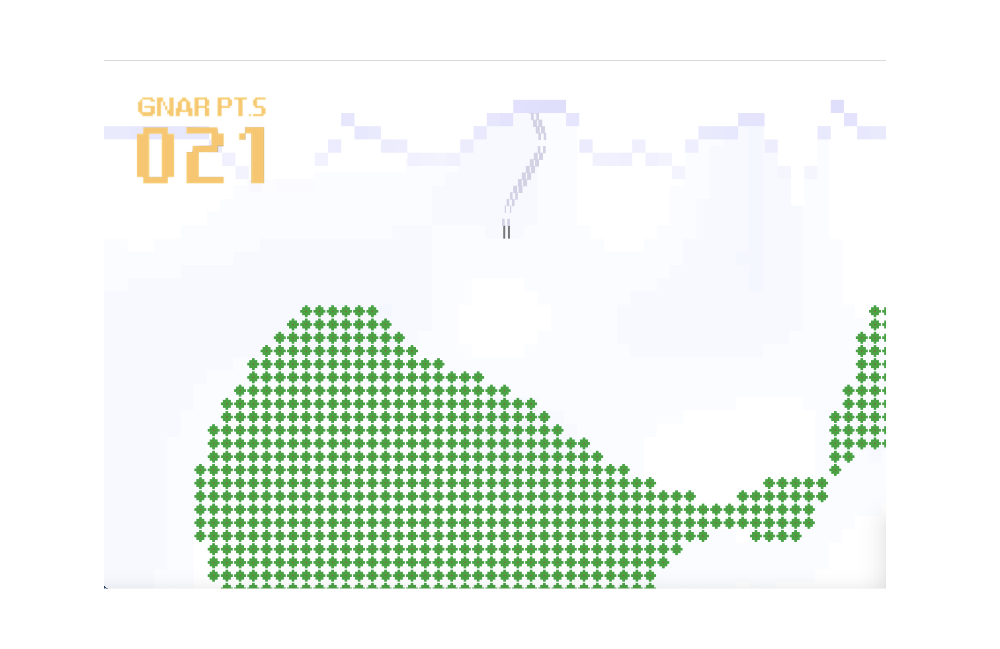

# G.N.A.R: UPenn BSE Digital Media Design Senior Project

## Abstract:

Taking inspiration from “G.N.A.R” the ski movie, the project aims to demonstrate the use of noise functions in procedurally generated terrain with a minimalistic obstacle avoidance game. Through Perlin noise and fractal brownian motion, the project investigates the algorithmic creation of ski slope surfaces, tree coverage, as well as simple avalanche simulation. Its intended purpose is to combine the playfulness in the culture of extreme snowsports with concepts in computer graphics.

## Game Blurb:

Collect G.N.A.R. points as you plummet down the slope on skis. Make sure to dodge the tree patches that come your way, but beware; an avalanche is chasing you – there is no time to look back!

* Note: [PyGame 2.6.1](https://www.pygame.org/news) is required for this program.

